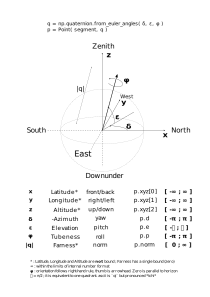

# superslice
A shape and path generator

*superslice* is a library to generate tool-trajectories (ultimately in G-code)
for part design. One major difference (that is at the same time a drawback and
a feature) with common CAD software is that objects are drawn relative to the
toolhead and not the opposite (the toolhead path is computed by - ie. - a
slicer). *superslice* was originally written for double-flux heat exchangers of
a fractal nature[^heatex] inspired by N. Désir ; *superslice* is dedicated to
this dude.  The original code was originally started in 2015 or so, it was
stolen and the backup lost, then rewritten (it still was not using quaternions)
before I figured out I should implement it properly because I could see trouble
ahead : this is the real thing.

[^heatex]: some slicers have the ability to make a *vase*, or continuous
    contour out of a solid ; this heat exchanger somewhat falls into this
    category but the "solid" that it would require gets very complicated and
    leads us into problems such as *"Object may not be a valid 2-manifold and
    may need repair!"*. I therefore concluded I should write everything *from
    scratch* (which is not quite true since I used many, many libs written by
    others). I give my thanks to all who have contributed to these libraries
    and to OSS in general.

*superslice* "forces" you to program the toolpath and _not_ the contour of the
parts you're designing. However, in certain conditions and with proper use of
parameters (such as tool size), it appears obvious that *superslice* allows you
to have very fine control over your build process : for instance, it is
possible to add an arbitrary amount of parameters (such as color, extrusion
ratio, material, ... ) to a build ; these parameters will NOT be lost when
"slicing" a part, because "slicing" never occurs within the *superslice*
paradigm : *superslice* already _is_ an advanced slicer. *superslice* makes use
of complex numbers for geometric transforms and allows you to easily program
paths and subpaths. As a consequence, *superslice* can be seen as a low-poly
model generator, but not only : one of its intented uses is to allow for
arbitrary polygon count while still retaining the desired shape[^dome].

[^dome]: one example is the [approximation of a sphere using a
dodecahedron](http://www.desertdomes.com/domecalc.html).

Below is a paraqraph (in French) that explains in more details how *superslice*
was born in relation to 3D printing in general.

## Inspirations

*superslice* has many inspirations, and may replace some of them in a distant
future. Here are some that are worth a mention:

* [OpenSCAD](https://openscad.org/)
* [Wings3D](http://www.wings3d.com/)
* Slicers:
    * Slic3r
    * Cura
    * Repetier
* [Inkscape](https://inkscape.org/)
* Blender

If in any doubt where the development of *superslice* may lead, these may give
a clue on the features and workflows.

## Definitions

Read [RFC 2119](https://www.rfc-editor.org/rfc/rfc2119).

### Vertex

A *Vertex* (`class Point`) is a region of space of infinitesimal dimension ; it
has a position and is oriented, it is basically a quaternion (`np.quaternion`
but we use `class Quat` to make it more user-friendly) with an arbitrary number
of addititional parameters (color, density...). Two or more `Point` instances
can coexist in the same region of space and with the same orientation (their
quaternion component is the same) ; Pauli's exclusion principle is not violated
because they do not need have the same state (and most of all reside in a
different memory space).

### Edge

An *Edge* is an *oriented linear segment* that starts and ends at two
(obviously distinct) `Point` instances. *Start* and *End* Points are by
definition not interchangeable, and an `Edge` does not exist as such beyond the
existence of the 2-tuple[^stc] that holds references to its both extremities.
An *Edge* has a finite length, but it has infinitesimal surface and
infinitesimal volume. An *Edge* has a *twist* that is directly determined by
the orientation of its *start-Point* and *end-Point*. *Edges* are always normal
to [field lines](https://en.wikipedia.org/wiki/Field_line).

[^stc]: subject to change

### Face

A *Face* is a *bounded geometric plane* ; **it is not** an [Euclidian
plane](https://en.wikipedia.org/wiki/Euclidean_plane) because it does not
*need* to be *"flat"*, and it is **bounded**[^bounded]. It has a number of
*Edges* that determine its shape in the projective Euclidian plane (ie. it's
outline) and in the normal plane (ie. altimetric contour, isobaric line). The
*Edges* that make a *Face* **MUST** (or at the very least SHOULD, although the
contrary may be hard as f* to visualize because it introduces linear
singularities) be contiguous and form a [closed
curve](https://en.wikipedia.org/wiki/Circulation_(physics)) ; a *Face* is
therefore oriented - regardless of the direction of the field lines that
traverse it! - and by convention this follows the right-hand rule where a
series of `Point` instances arranged in the trigonometric direction
(counterclockwise) define *above* as in *"what one sees when looking down
towards the thumb*" and *below* as in *"what one sees when looking up towards
the thumb, ie. the ring finger hiding the rest of the hand"*. Typically,
*above* will be the **outside** of a solid (what one would see looking at the
Earth from outer space) while *below* would be the **inside** of a solid (can't
physically be seen).

The vertices that define a *Face* are usually coplanar (on the same Euclidian
plane), but this is not a prerequisite as they can be on any abitrary plane
such as a [Hyperbolic
paraboloid](https://en.wikipedia.org/wiki/Paraboloid#Hyperbolic_paraboloid) ;
in fact, moving a *Vertex* away from the "standard" Euclidian plane should
(rather, must) *warp* that plane and everything that depends on it (TODO: any
real mathematicians out here to sort this out?).

At least three *Edge* instances are required to define a *Face* (or else it is
just a *non-oriented segment* but this can get massively weird). Since (at
least by standard geometric practices) the *end* `Point` of an *Edge* is the
same as the *start* `Point` of the next *Edge*, there is a level of redundancy
: this is kept because:

* it is computationally more efficient
* from the author's point-of-view, this apparently makes sense (at least
  mathematically)

A *Face* does not exist as such beyond the n-tuple that holds references to
each of its *Edge* components[^stc] ; it has a finite surface but infinitesimal
volume.

A *Face* can be **tesselated** or **filled** (TODO).

[^bounded]: in theory, it should be possible to extrapolate the most obvious
    unbounded non-Euclidian plane of which a *Face* is a subset of.

### Segment

A `Segment` is composed of a number of `Point` instances ; a `Segment` can be
layered and sub-layered onto yet another dimension which we can refer to as
*"time"*, *"elevation relative to its base"* or something else. Unlike the
*Face*, a `Segment` needs not be a closed loop (but it MAY be). Since this
extra dimension can be whatever one chooses it to be[^hal], we call it *gamma*.

A `Segment` has a finite length (but it can vary), but no notion of surface nor
volume (not even infinitesimal).

A `Segment` can be mapped onto an *Edge* (TODO) : this will alter its dimension,
orientation and spatial position.

### Gamma

There is a *global gamma*, and a *local gamma* : the former is
global[^pseudoglobal] throughout the scope of the program, while the latter is
relative to a `Segment` (each of these start and end at specific values of the
*global gamma*, sp the *local gamma* is a lienar-normalized subset of the
*global gamma*)

[^hal]: The result will ultimately depend on the HAL (Hardware Abstraction
    Layer) used
[^pseudoglobal]: it is **not** global in the programmer's (in this case
    Pythonic) point-of-view, only within the field of the object that is being
    drawn

## Quaternions

Quaternions are an absolutely amazing mathematical tool, but they have the
problem of being widely misunderstood. There have been other attempts in
similar directions such as Octonions and Hexanions.

When it comes to 3D space, quaternions add a level of redundancy : we only have
three dimensions in space, but four vector components. This allows us to get
around any singularity that may arise when doing trignonometrical computations
especially when some angles approach zero. Quaternions are the methematical
"explanation" of how to get around silly things like [gimbal
lock](https://en.wikipedia.org/wiki/Gimbal_lock) : there are other domains
where it is now obvious that having more dimensions dramatically reduces the
risk of getting stuck in a local minima or maxima (deep neural networks are one
such example).

Since quaternions are somehow abstract, they act like a black box : one can put
data inside and pull data from a quaternion, but it's easy to get lost. In
order to ensure the data that comes out matches what we expect, we need to be
very clear on what is done and how it is done ; in this regard, quaternions
have this marvelous property that they can be *normalized*. This makes them
very cute and lovable things and enables us to very easily perform computations
across referentials that will move around our 3D space.

### Standardisation problem

Quaternions are a great tool, but their usage is hindered by a lack of
standardisation. Quote `numpy-quaternions`:

    as_euler_angles(q)
        Open Pandora's Box

        If somebody is trying to make you use Euler angles, tell them no, and
        walk away, and go and tell your mum.

        You don't want to use Euler angles.  They are awful.  Stay away.  It's
        one thing to convert from Euler angles to quaternions; at least you're
        moving in the right direction.  But to go the other way?!  It's just not
        right.

I strongly advise reading
https://github.com/moble/quaternion/wiki/Euler-angles-are-horrible before you
proceed.

Here is my attempt at an RFC to some sort of standardisation:

As you may read from the code, I make quite some use of Euler angles ; while
this may not be the most mathematically sound way to go, it works because I
stick to a standard. I have only learned some basic operations with complex
numbers in the schooling system, when it comes to quaternions it was more
trial-and-error than anything else. Contributions to clean the relevant code
sections are most welcome.

### Miscellaneous notes on quaternion usage

The `quaternion` module is an add-on to `numpy` that needs to be installed
separately ; importing both `numpy` and `quaternion` modules will add a
`numpy.quaternion` object **which is not the same** as the `quaternion` object.

# superslice : un générateur de forme et de chemins

Une impression 3d ou un usinage numérique comprend 4 étapes principales:

1. dessin de la pièce avec un logiciel CAD, à choix selon le type de pièce à
   dessiner et les préférences de l'utilisateur
1. exportation d'un solide en STL (ou format similaire)
1. *slicing*, à savoir le découpage dun solide en couches et la détermination
   de la trajectoire de l'outil, couche par couche
1. usinage (ou impression) en soi : la machine fait bêtement ce qu'on lui a
   demandé de faire et sans se poser aucune question

Le slicing est une étape très importante du processus ; on trouve par ailleurs
plusieurs slicers et il est parfois nécessaire de choisir le bon slicer pour
obtenir des résultats acceptables tout comme la configuration des paramètres du
slicer lui-meme peuvent avoir une large influence sur le résultat final : en
effet, le processus de slicing est globalement **non-déterministe** (du moins à
l'étape de la conception) et lors de l'exportation de l'objet en STL on *perd*
de l'information : la fonctionnalité de tel ou tel composant de l'objet est
perdue. Il n'est généralement pas possible d'utiliser les "défauts" d'usinage à
bon escient (voir l'acronyme INABIAF). *superslice* contourne ce problème en
supprimant de façon pure et simple le processus du *slicing* : la conception
des pièces se fait en prenant en compte, lors de la phase de dessin, les
contraintes auxquelles la pièce peut être soumise. Ainsi, l'utilisateur ne
*dessine pas un volume* mais *programme des trajectoires* ; il n'est pas
nécessaire de slicer le modèle car les trajectoires de l'outil sont programmées
*lors de du dessin* de la pièce. Il est donc possible de gérer - à l'étape de
la conception - des paramètres tels que la température de la buse, la vitesse
d'impression, et surtout l'ordre exact dans lequel la machine-outil va réaliser
les opérations. *superslice* s'appuye sur les vecteurs tournants et permet de
gérer une "infinité" d'autres paramètres, tels que la couleur d'impression.

Lorsque l'on dessine une pièce, on a parfois envie de donner plus d'épaisseur à
un endroit donné afin de permettre un usinage ultérieur (par exemple un
taraudage) ou parce qu'on désire améliorer la résistance mécanique de l'objet à
cet endroit ; le workflow standard ne permet pas ce genre de détails car il y a
**perte d'information** lors de l'exportation en STL. Avec *superslice*, vous
dessinez votre pièce *dans le slicer*, c'est-à-dire que vous dessinez votre
pièce en programmant directement la trajectoire de l'outil (ou tête
d'impression) : il est donc possible et aisé de définir l'ordre des opérations
sans se poser la question des absurdités que le slicer pourrait exhiber.
Ci-dessous, on peut voir un exemple rééel de cette limitation ; le remplissage
ne touche juste pas le trou dans le cylindre du centre et ne lui apporte donc
aucune rigidité supplémentaire :

Dans de nombreux cas, il serait préférable de construire le remplissage d'une
manière *mathématiquement favorable*, par exemple ainsi:

Il est facile de trouver de [très nombreux
exemples](https://www.pinterest.fr/pin/3377768463751360/), comme le cône
ci-après:

Dans d'autres cas (découpage de tôles par exemple) il est indispensable
d'effectuer les découpes dans un ordre particulier si l'on veut éviter que des
découpes partielles ne tombent au fond de la machine ; *superslice* est alors
l'allié indispensable.

*superslice* est au stade de développement alpha ; de nombreuses fonctions sont
en attente de développement et le générateur de G-code n'en est qu'à ses
débuts.

*superslice* est codé en Python 3 et utilise
[VisPy](https://github.com/vispy/vispy/) ou
[matplotlib](https://matplotlib.org) pour le rendu ; à l'heure acntuelle le
code source n'est pas disponible mais ceux qui sont motivés peuvent demander à
y contribuer en contactant [JCZD](/i18n//members/jczd/)
